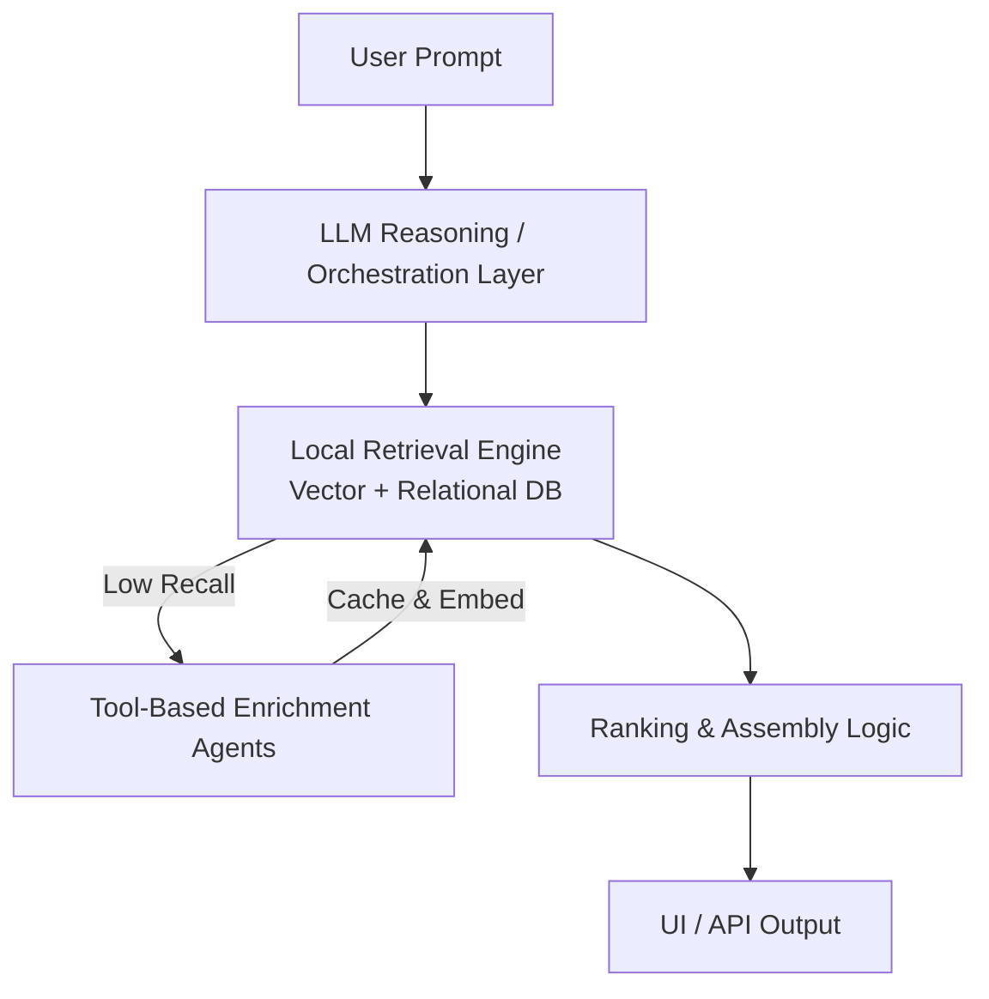
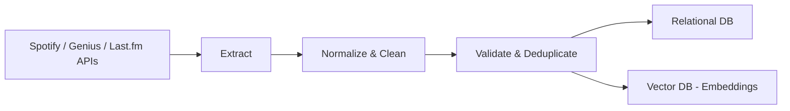

# EchoAgent 

EchoAgent is an **agentic, multimodal music discovery system** that translates highly specific natural‑language “vibe” prompts into structured music search and playlist generation logic.

Rather than relying on coarse genres or static mood tags, EchoAgent is designed to reason over **lyrics, audio features, cultural metadata, and aesthetic descriptors** to curate playlists that match nuanced user intent.

> **Project status:** Active development — backbone architecture, data schemas, and prompt‑mapping framework are in place.

---

## 🎧 Motivation


Users often struggle to express *exactly* what they want in a playlist. EchoAgent aims to bridge that gap by letting users describe a vibe — e.g.:

> “Songs with a slow build, layered synths, and cosmic feeling, like at midnight on a neon highway.”

EchoAgent aims to close the gap between **how humans describe music** and **how music systems retrieve it**.

---

## ⚙️ System Overview

EchoAgent is structured as a modular retrieval system with agent-driven reasoning at the edges:
1. Interprets free‑form user prompts using an LLM‑driven reasoning layer
2. Converts prompts into structured attributes and embeddings
3. Retrieves candidate tracks from a local multimodal database
4. Dynamically enriches results using external music APIs when needed
5. Ranks and assembles a playlist optimized for relevance and diversity

---

## 🏗 Architecture (Planned)


**How to read this architecture**

EchoAgent is designed around a clear separation of concerns:
- LLM-driven components focus on interpretation, reasoning, and decision-making
- Retrieval, ranking, and data storage remain deterministic and system-controlled
- External data sources are accessed only when local recall is insufficient

The reasoning and orchestration layer is designed to support agent-based execution (e.g., via LangChain), enabling modular prompt interpretation, tool routing, and conditional enrichment without coupling core system logic to an LLM framework. LLM and embedding providers are treated as interchangeable dependencies, enabling experimentation across models with different cost, latency, and context tradeoffs.


---

## 📦 ETL & Data Flow


**How to read the ETL pipeline**

The ingestion pipeline is designed for repeatability, traceability, and incremental growth:
- External sources are treated as non-authoritative and normalized on entry
- Validation and deduplication ensure stable identifiers across modalities
- Embeddings are generated once and reused across retrieval and agent workflows

This design allows EchoAgent to scale its corpus over time while keeping retrieval fast, deterministic, and cost-efficient.


---

## 🗂 Data Model (Current)

EchoAgent maintains two complementary data stores:

**Relational DB**
- Song metadata (title, artist, album)
- Audio features (tempo, key, energy, valence)
- Tag sources and provenance

**Vector DB**
- Lyrics embeddings
- Prompt and semantic embeddings
- (Planned) album art and audio embeddings

---

## 🧩 Prompt → Attribute Mapping

A core design component of EchoAgent is a structured mapping layer that translates unstructured prompts into retrieval‑ready signals, such as:

- Semantic embedding of the full prompt
- Audio constraints (tempo ranges, energy levels, modality)
- Lyrical themes or keywords
- Aesthetic or contextual cues
- Orchestrated via a lightweight agent framework to allow iterative reasoning and extensibility

---

## ✅ What Exists Today

- Versioned relational and vector database schemas
- Formalized prompt-to-attribute mapping specification
- Defined boundaries between agent reasoning and system logic
- End-to-end architectural and data flow design


---

## 🛠 Tech Stack (Planned)

- **Language:** Python
- **Backend:** FastAPI
- **UI:** Streamlit
- **Vector DB:** ChromaDB or FAISS
- **Relational DB:** SQLite / PostgreSQL
- **LLMs & Embeddings:** Provider-agnostic (e.g., OpenAI, Gemini, Anthropic)
- **Agent Orchestration (Optional):** LangChain
- **APIs:** Spotify, Genius, Last.fm
- **Deployment:** Platform-agnostic (e.g., Hugging Face Spaces, GCP)

---

## 📁 Repository Structure

```
EchoAgent/
├── backend/                    # Core application backend
│   ├── agents/                 # AI agents for processing
│   ├── api/                    # FastAPI application
│   │   └── routes/             # API route handlers
│   ├── data/                   # Data management and ingestion
│   └── utils/                  # Utility modules
│
├── docs/                       # Documentation
│   └── specs/                  # Detailed specifications
│
├── notebooks/                  # Jupyter notebooks for exploration
│
└── tests/                      # Test suite
```

### Directory Descriptions

- **`backend/agents/`**: Contains the core AI agents that process user prompts, enrich track data, and rank playlists.
- **`backend/api/`**: FastAPI application exposing REST endpoints for playlist recommendations and health checks.
- **`backend/api/routes/`**: API route handlers for different endpoints.
- **`backend/data/`**: Database models, embedding utilities, and data ingestion scripts for external APIs (Spotify, Genius).
- **`backend/utils/`**: Shared utility functions and configurations.
- **`docs/`**: Project documentation including specifications, roadmaps, and architectural decisions.
- **`docs/specs/`**: Detailed technical specifications and design documents.
- **`notebooks/`**: Jupyter notebooks for experimentation, EDA, and prototyping.
- **`tests/`**: Unit and integration tests for the application.

---

## 🧭 Roadmap

- Implement ingestion, normalization, and embedding pipelines
- Establish baseline similarity search and ranking
- Introduce tool-based enrichment agents
- Deploy interactive demo and evaluation loop


---

EchoAgent is being developed as a systems‑focused project emphasizing **ML engineering, data infrastructure, and agentic design**.
