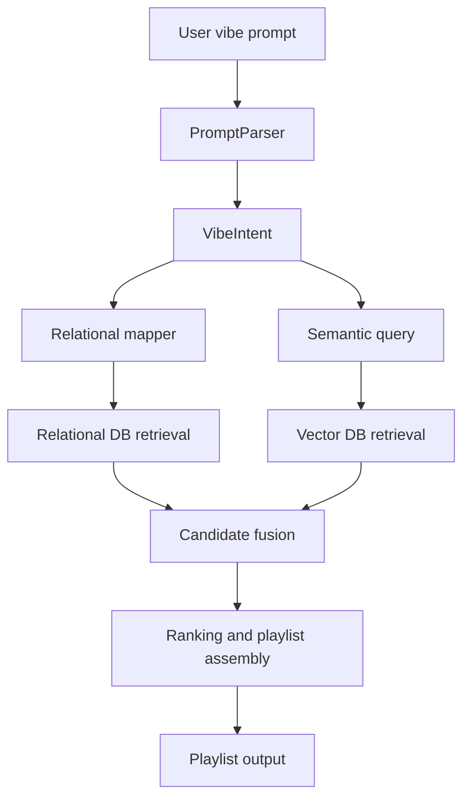
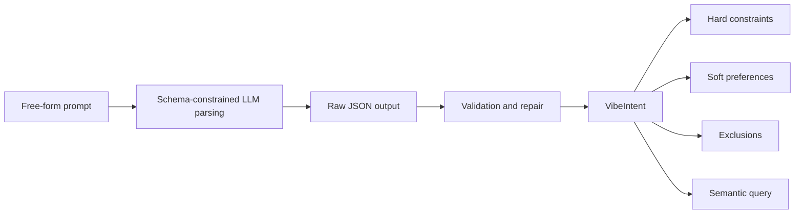
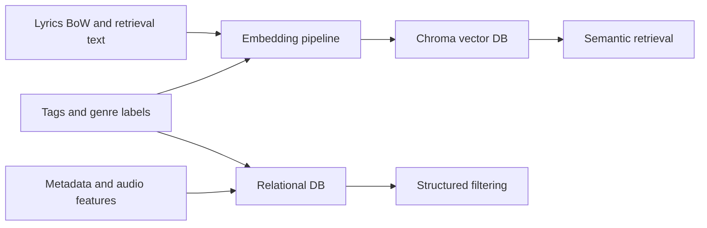
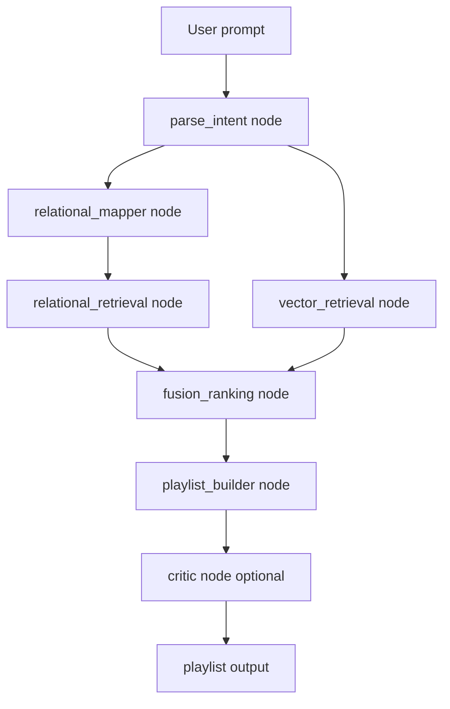

# EchoAgent

EchoAgent is a music discovery and playlist generation project for translating free-form **vibe prompts** into structured retrieval, hybrid search, and playlist assembly logic. The project is being built as a portfolio piece focused on ML/AI systems design, retrieval, data engineering, and agentic orchestration rather than as a thin wrapper around a single LLM call.

## 🎧 Motivation

The goal is to let a user describe a playlist the way people naturally do, with language such as atmosphere, context, energy, exclusions, and emotional cues, and convert that into a system that can retrieve and assemble relevant tracks. The current design separates language understanding from deterministic retrieval and ranking so that ambiguous prompt interpretation can be handled by an LLM while database queries, filtering, and playlist construction remain system-controlled and inspectable.

Example prompts:

- "Late-night train ride through a rainy city, introspective but not depressing."
- "Warm, nostalgic indie for an autumn walk, low energy, no acoustic ballads."
- "High-energy gym tracks with strong rhythm and minimal lyrical focus."

## ⚙️ System Overview

EchoAgent is currently shaped as a hybrid retrieval system with a typed intent layer in front of relational and vector search. The main flow is: parse the prompt, normalize it into a structured contract, retrieve candidate tracks from two complementary stores, then fuse and rank them into a playlist.


```mermaid
flowchart TD
    A[User vibe prompt] --> B[PromptParser]
    B --> C[VibeIntent]
    C --> D[Relational mapper]
    C --> E[Semantic query]
    D --> F[Relational DB retrieval]
    E --> G[Vector DB retrieval]
    F --> H[Candidate fusion]
    G --> H
    H --> I[Ranking and playlist assembly]
    I --> J[Playlist output]
```

This diagram reflects the current architectural intent more accurately than the previous README because it centers the existing parser, typed intent object, mapper, and vector retrieval wrapper that are already present in the repository. The retrieval and ranking path is deliberately system-controlled, while the prompt interpretation edge is where LLM-based reasoning is currently most useful. 

## 🏗 Current architecture

The repository already contains the core pieces needed for a hybrid retrieval stack. It includes a prompt parser, a typed intent contract, a relational retrieval mapping layer, a vector retrieval layer, local data and embedding utilities, documentation, notebooks, and tests. 

### 🪄 Prompt understanding

`PromptParser` converts a natural-language prompt into a validated `VibeIntent` object with four main fields: `semantic_query`, `hard_constraints`, `soft_preferences`, and `exclusions`. It uses a schema-driven prompt and validation flow, including retry-and-repair behavior when the model output is invalid JSON.

`VibeIntent` acts as the typed contract between language understanding and retrieval/ranking logic. It normalizes values, canonicalizes certain fields, and checks for contradictions such as overlap between hard constraints, soft preferences, and exclusions. 


```mermaid
flowchart LR
    A[Free-form prompt] --> B[Schema-constrained LLM parsing]
    B --> C[Raw JSON output]
    C --> D[Validation and repair]
    D --> E[VibeIntent]
    E --> F[Hard constraints]
    E --> G[Soft preferences]
    E --> H[Exclusions]
    E --> I[Semantic query]
```

### ⛓️ Relational retrieval

The relational database stores artist, album, and track metadata together with audio features such as tempo, danceability, energy, loudness, mode, and duration, plus seed genre labels, top tags, and lyrics bag-of-words data. This store is implemented with SQLAlchemy models and query helpers that support structured filtering over year, genre, tempo, energy, and danceability ranges. 

The relational retrieval mapper translates `VibeIntent.hard_constraints` into deterministic database filters. It already supports mappings for artist, genre, year or era, tempo, energy, and danceability, including both bucketed values such as `low` or `medium` and explicit numeric ranges. 

### ↗️ Vector retrieval

The vector side uses ChromaDB and sentence-transformer embeddings for track text retrieval, with utilities for embedding generation, metadata extraction, upsert, and semantic search. The embedding layer supports persisted Chroma collections and query-time semantic search using `semantic_query` text derived from the prompt. 

The current vector retrieval wrapper already returns cleaned candidate objects and includes a LangGraph-style node interface, which makes it a natural building block for a graph-based orchestration layer. 

## 📦 Data stores

EchoAgent uses two complementary local data stores.


```mermaid
flowchart LR
    A[Metadata and audio features] --> B[Relational DB]
    C[Tags and genre labels] --> B
    D[Lyrics BoW and retrieval text] --> E[Embedding pipeline]
    C --> E
    E --> F[Chroma vector DB]
    B --> G[Structured filtering]
    F --> H[Semantic retrieval]
```

### Relational DB

- Artist, album, and track metadata. 
- Audio features including tempo, danceability, energy, loudness, mode, and duration.
- Seed genre labels and top tag metadata. 
- Lyrics bag-of-words storage for downstream use.

### Vector DB

- Persisted Chroma collections for track text embeddings and legacy lyrics embeddings. 
- Sentence-transformer-based embedding generation and semantic query support. 
- Metadata attached to vector entries for downstream retrieval and filtering. 

## 🧩 Design principles

A central design decision in this project is to be selective about where agentic reasoning is useful. Prompt interpretation is inherently ambiguous and benefits from LLM-based parsing, while retrieval mapping and database querying are better handled as deterministic system components. 

The planned orchestration direction is therefore not "everything is an agent," but rather a mixed system of LLM-driven and deterministic nodes connected through LangGraph. That allows the project to showcase agentic workflow design without sacrificing traceability or engineering rigor. [

## 📈 Planned LangGraph workflow

The next implementation phase is centered on a LangGraph orchestration layer. The intended workflow is:


```mermaid
flowchart TD
    A[User prompt] --> B[parse_intent node]
    B --> C[relational_mapper node]
    C --> D[relational_retrieval node]
    B --> E[vector_retrieval node]
    D --> F[fusion_ranking node]
    E --> F
    F --> G[playlist_builder node]
    G --> H[critic node optional]
    H --> I[playlist output]
```

This graph reflects the current project direction: one stateful workflow that combines parsed intent, deterministic retrieval, semantic retrieval, candidate fusion, and playlist assembly. The existing codebase already provides strong building blocks for the intent, mapper, and vector retrieval nodes.

## ✅ Project status

What is implemented now:

- Schema-driven prompt parsing into structured intent objects. 
- Typed `VibeIntent` contract with normalization and validation. 
- Relational database models and query helpers.
- Deterministic mapping from intent constraints to relational filters.
- Chroma-backed embedding management and semantic retrieval utilities.
- A vector retrieval wrapper designed to be usable directly or as a LangGraph node. 
- Repository structure with docs, notebooks, and tests already in place.

What is actively being built next:

- LangGraph state schema and node interfaces. 
- Relational retrieval node integration alongside the existing vector node direction. 
- Hybrid candidate fusion and ranking logic. 
- Playlist assembly logic with relevance and diversity tradeoffs. 
- API and interactive app layer for public use and demos.

## 📁 Repository structure

```
EchoAgent/
├── backend/                    # Core application backend
│   ├── agents/                 # AI agents for processing
│   ├── api/                    # FastAPI application
│   │   └── routes/             # API route handlers
│   ├── data/                   # Data management and ingestion
│   └── utils/                  # Utility modules
│
├── docs/                       # Documentation
│   └── specs/                  # Detailed specifications
│
├── notebooks/                  # Jupyter notebooks for exploration
│
└── tests/                      # Test suite
```

This structure reflects the current emphasis of the repository: prompt understanding modules, retrieval modules, local data infrastructure, documentation, and early test coverage.

## 🛠 Tech stack

- Python for the core system and data pipeline. 
- SQLAlchemy-backed relational storage over SQLite today, with the schema written in a way that can also support PostgreSQL. 
- ChromaDB plus sentence-transformer embeddings for semantic retrieval. 
- Transformer-based LLM prompting for schema-constrained prompt parsing. 
- LangGraph as the planned orchestration layer for the multi-step retrieval and playlist workflow. 
- FastAPI and an interactive front end as the planned serving layer. 

## 🛣️ Near-term roadmap

- Build the LangGraph state object and first workflow graph. 
- Add a relational retrieval node that plugs into the same graph state as vector retrieval. 
- Implement hybrid fusion and ranking over relational and vector candidates. 
- Add playlist construction logic with basic diversity controls.
- Expose the graph through an API and interactive demo. 
- Expand test coverage around prompt parsing, retrieval correctness, and playlist behavior.

## Notes

The public README focuses on architecture, current progress, and next steps. The current state of the project is best described as a partially implemented hybrid retrieval system with a clear path toward LangGraph-based orchestration and playlist generation. 
