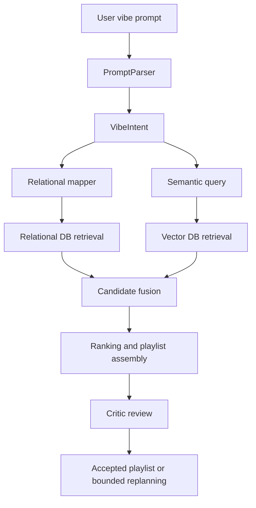
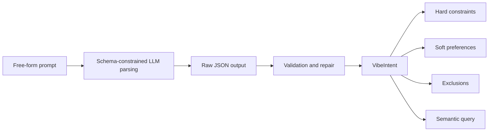
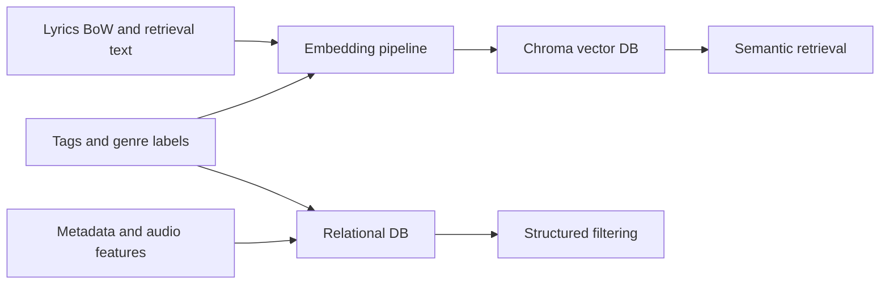
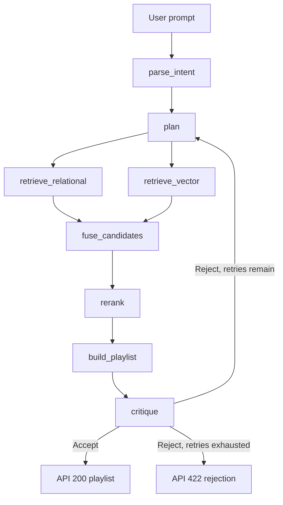

# EchoAgent

EchoAgent is a music discovery and playlist generation project for translating free-form **vibe prompts** into structured retrieval, hybrid search, and playlist assembly logic. The project is being built as a portfolio piece focused on ML/AI systems design, retrieval, data engineering, and agentic orchestration rather than as a thin wrapper around a single LLM call.

## 🎧 Motivation

The goal is to let a user describe a playlist the way people naturally do, with language such as atmosphere, context, energy, exclusions, and emotional cues, and convert that into a system that can retrieve and assemble relevant tracks. The current design separates language understanding from deterministic retrieval and ranking so that ambiguous prompt interpretation can be handled by an LLM while database queries, filtering, and playlist construction remain system-controlled and inspectable.

Example prompts:

- "Late-night train ride through a rainy city, introspective but not depressing."
- "Warm, nostalgic indie for an autumn walk, low energy, no acoustic ballads."
- "High-energy gym tracks with strong rhythm and minimal lyrical focus."

## 🚀 Getting Started

```bash
# 1. Create and activate the conda environment
conda env create -f environment.yml
conda activate echoagent-env

# 2. Configure environment variables
cp .env.example .env
# then fill in GROQ_API_KEY (required) — see .env.example for optional vars

# 3. Start the backend API
uvicorn backend.api.main:app --reload --port 8000

# 4. Sanity check
curl http://localhost:8000/health
```

The next product milestone is a Streamlit frontend (`streamlit run frontend/app.py`, once built) calling FastAPI over HTTP. The backend, critic loop, JSON repairs, and offline graph/API tests are implemented. A successful live accepted playlist on the latest code remains unverified: recent calls hit Groq token-per-minute limits.

Test the API from another terminal:

```bash
curl -sS -i 'http://127.0.0.1:8000/recommend' -H 'Content-Type: application/json' -d '{"prompt":"late-night rainy city drive"}'
```

Run the focused offline suite (last result: **85 tests passed**; no real Groq/database calls):

```bash
python -m pytest tests/test_json_reliability.py tests/test_api.py tests/test_playlist_builder.py tests/test_candidate_fuser.py tests/test_reranker.py -q
```

Accepted playlists return 200. Final critic rejection returns 422 with `detail.code = "playlist_rejected"`, message, reason, and retry count; no rejected tracks are returned. Empty results return 404. Groq failures, including upstream 429 quota errors, currently return API 502. Successful response debug data includes `builder_fallback_used` and `builder_fallback_reason`.

See [testing and troubleshooting](docs/testing.md) for error interpretation and verification limits, and [the web-app plan](docs/web_app_full_data_plan.md) for milestones. Rate-limit backoff, per-agent token budgets, strict exclusion enforcement, and metadata enrichment are explicitly deferred; frontend development is not skipped.

## ⚙️ System Overview

EchoAgent is currently shaped as a hybrid retrieval system with a typed intent layer in front of relational and vector search. The main flow is: parse the prompt, normalize it into a structured contract, retrieve candidate tracks from two complementary stores, then fuse and rank them into a playlist.


```mermaid
flowchart TD
    A[User vibe prompt] --> B[PromptParser]
    B --> C[VibeIntent]
    C --> D[Relational mapper]
    C --> E[Semantic query]
    D --> F[Relational DB retrieval]
    E --> G[Vector DB retrieval]
    F --> H[Candidate fusion]
    G --> H
    H --> I[Ranking and playlist assembly]
    I --> J[Critic review]
    J --> K[Accepted playlist or bounded replanning]
```

The pipeline combines deterministic retrieval and scoring with LLM-driven parsing, planning, playlist selection, and critic review.

## 🏗 Current architecture

The repository already contains the core pieces needed for a hybrid retrieval stack. It includes a prompt parser, a typed intent contract, a relational retrieval mapping layer, a vector retrieval layer, local data and embedding utilities, documentation, notebooks, and tests. 

### 🪄 Prompt understanding

`PromptParser` converts a natural-language prompt into a validated `VibeIntent` object with four main fields: `semantic_query`, `hard_constraints`, `soft_preferences`, and `exclusions`. It uses a schema-driven prompt and validation flow, including retry-and-repair behavior when the model output is invalid JSON.

`VibeIntent` acts as the typed contract between language understanding and retrieval/ranking logic. It normalizes values, canonicalizes certain fields, and checks for contradictions such as overlap between hard constraints, soft preferences, and exclusions. 


```mermaid
flowchart LR
    A[Free-form prompt] --> B[Schema-constrained LLM parsing]
    B --> C[Raw JSON output]
    C --> D[Validation and repair]
    D --> E[VibeIntent]
    E --> F[Hard constraints]
    E --> G[Soft preferences]
    E --> H[Exclusions]
    E --> I[Semantic query]
```

### ⛓️ Relational retrieval

The relational database stores artist, album, and track metadata together with audio features such as tempo, danceability, energy, loudness, mode, and duration, plus seed genre labels, top tags, and lyrics bag-of-words data. This store is implemented with SQLAlchemy models and query helpers that support structured filtering over year, genre, tempo, energy, and danceability ranges. 

The relational retrieval mapper translates `VibeIntent.hard_constraints` into deterministic database filters. It already supports mappings for artist, genre, year or era, tempo, energy, and danceability, including both bucketed values such as `low` or `medium` and explicit numeric ranges. 

### ↗️ Vector retrieval

The vector side uses ChromaDB and sentence-transformer embeddings for track text retrieval, with utilities for embedding generation, metadata extraction, upsert, and semantic search. The embedding layer supports persisted Chroma collections and query-time semantic search using `semantic_query` text derived from the prompt. 

The current vector retrieval wrapper already returns cleaned candidate objects and includes a LangGraph-style node interface, which makes it a natural building block for a graph-based orchestration layer. 

## 📦 Data stores

EchoAgent uses two complementary local data stores.


```mermaid
flowchart LR
    A[Metadata and audio features] --> B[Relational DB]
    C[Tags and genre labels] --> B
    D[Lyrics BoW and retrieval text] --> E[Embedding pipeline]
    C --> E
    E --> F[Chroma vector DB]
    B --> G[Structured filtering]
    F --> H[Semantic retrieval]
```

### Relational DB

- Artist, album, and track metadata. 
- Audio features including tempo, danceability, energy, loudness, mode, and duration.
- Seed genre labels and top tag metadata. 
- Lyrics bag-of-words storage for downstream use.

### Vector DB

- Persisted Chroma collections for track text embeddings and legacy lyrics embeddings. 
- Sentence-transformer-based embedding generation and semantic query support. 
- Metadata attached to vector entries for downstream retrieval and filtering. 

## 🧩 Design principles

A central design decision in this project is to be selective about where agentic reasoning is useful. Prompt interpretation is inherently ambiguous and benefits from LLM-based parsing, while retrieval mapping and database querying are better handled as deterministic system components. 

LangGraph connects LLM-driven agents with deterministic retrieval and scoring nodes. Each stage has an explicit input and output contract.

## 📈 LangGraph workflow

The orchestration layer is implemented in `backend/agents/playlist_graph.py`. The workflow is:


```mermaid
flowchart TD
    A[User prompt] --> B[parse_intent]
    B --> C[plan]
    C --> D[retrieve_relational]
    C --> E[retrieve_vector]
    D --> F[fuse_candidates]
    E --> F
    F --> G[rerank]
    G --> H[build_playlist]
    H --> I[critique]
    I -->|Accept| J[API 200 playlist]
    I -->|Reject, retries remain| C
    I -->|Reject, retries exhausted| K[API 422 rejection]
```

Empty playlists return API 404. Provider and parsing failures follow the [documented error mapping](docs/testing.md).

This graph reflects the implemented workflow: one stateful LangGraph pipeline combining parsed intent, deterministic retrieval, semantic retrieval, candidate fusion, scoring, and playlist assembly. The critic routes back to the planner on rejection, capped at `max_retries`.

## ✅ Project status

What is implemented:

- Schema-driven prompt parsing into structured intent objects.
- Typed `VibeIntent` contract with normalization and validation.
- `PlannerAgent` producing a structured `PlaylistPlan` with scoring weights and retrieval limits.
- Relational database models, query helpers, and deterministic intent-to-filter mapping.
- Chroma-backed embedding management and semantic retrieval utilities.
- `CandidateFuser` merging relational and vector candidates by track ID.
- Deterministic `Reranker` executing planner-supplied weights with per-candidate score components.
- `PlaylistBuilderAgent` with model-guided diversity, unique-ID validation, and a pool that expands to the requested size; short pools use available unique tracks.
- Full LangGraph orchestration graph with parallel retrieval, critic routing, and retry loop.
- Shared `PlaylistGraphState` schema across all nodes.
- `CriticAgent` integrated into the runner, with previous-plan/feedback input to replanning and capped retries.
- FastAPI `GET /health` and `POST /recommend`, including final-rejection handling.
- JSON mode across all four agents, bounded repairs, completion diagnostics, and ranked-track fallback visibility.
- Offline API and real-graph tests with scripted external I/O; focused suite: 85 passed.

Next: the Streamlit frontend MVP. Live acceptance verification remains pending under the current Groq quota; deferred backend work is tracked in [future work](docs/future.md).

## 📁 Repository structure

```
EchoAgent/
├── backend/                    # Core application backend
│   ├── agents/                 # LangGraph nodes and agents
│   ├── api/                    # FastAPI application
│   │   └── routes/             # API route handlers
│   ├── data/                   # Data management and ingestion
│   └── utils/                  # Utility modules
│
├── database/                   # Persisted data stores
│   └── chroma_db/              # ChromaDB vector store
│
├── docs/                       # Documentation
│   ├── architecture.md         # Design decisions and rationale
│   ├── future.md               # Deferred and Phase 2 ideas
│   ├── roadmap.md              # Current status and next priorities
│   └── specs/                  # Detailed interface specifications
│
├── notebooks/                  # Jupyter notebooks for exploration and testing
│
└── tests/                      # Test suite
```

This structure reflects the current emphasis of the repository: prompt understanding modules, retrieval modules, local data infrastructure, documentation, and early test coverage.

## 🛠 Tech stack

- Python for the core system and data pipeline. 
- SQLAlchemy-backed relational storage over SQLite today, with the schema written in a way that can also support PostgreSQL. 
- ChromaDB plus sentence-transformer embeddings for semantic retrieval. 
- Transformer-based LLM prompting for schema-constrained prompt parsing. 
- LangGraph orchestrates the multi-step retrieval and playlist workflow.
- FastAPI serves the backend; a Streamlit frontend is planned.

## 🛣️ Near-term roadmap

- Build the Streamlit frontend against the current API contract, including error and debug displays.
- Verify a fully accepted live playlist when provider quota permits.
- Continue the full-dataset processing track independently of the subset UI.
- Keep metadata enrichment, strict exclusion enforcement, and rate-limit improvements deferred as agreed.

## Future directions
Post-MVP:
- Live list of tracks which the user can send to their audio service of choice (Spotify, Apple Music, etc.)
- User feedback loop for refining playlist results over time.

## Notes

The backend hybrid retrieval and agent workflow is implemented and tested offline. The frontend is next; live acceptance and the explicitly deferred improvements remain open.
